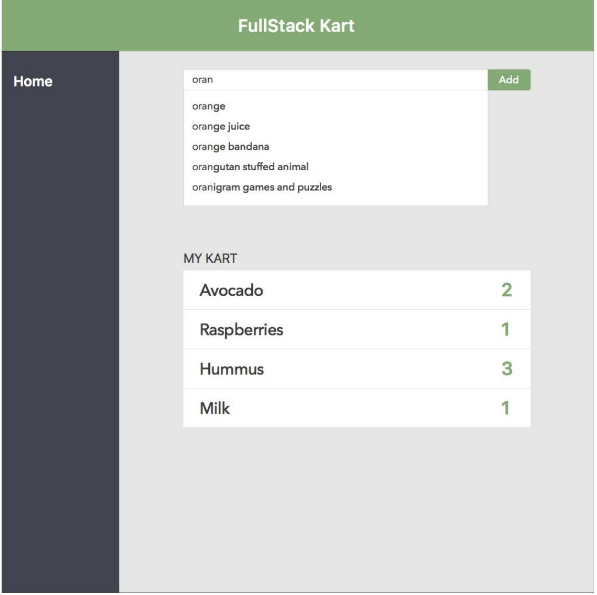

## Summary
Create a simple app that allows users to add grocery items to a virtual cart. This is a full-stack
project that requires both a front-end and back-end.
General Requirements

- Use git while developing the app. To share it with us, make it available on a public repo
in GitHub/GitLab/etc., or send us a zipped copy of your project with the .git directory
included.
- The front-end should be built in React.
- The API can be built in any technology.

## The Front-End Application
The app should be able to:
- Show suggestions as the user types (we’ll provide you with a list of initial items to include
in your suggestions).
- Allow users to add an item to a cart.
- Increment the count for existing items if they are added twice.
See mockup below for the app’s UI.

## The Back-End
The backend should include an API that has the following endpoints.
- GET /suggestions
- POST /kartItem
- GET /kart
The cart should be saved and retrieved upon new launches of the app.

## The Initial List of Item Suggestions
See `items.json` included in the repository.

## Bonus Items
- Make your application testable.
- Allow users to remove items from the list.
- Grow the list of suggestions as users add items not seen before.